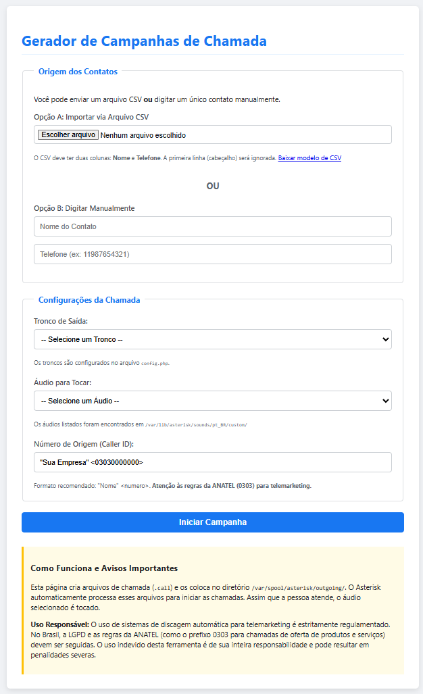

# Gerador de Campanhas de Chamada para Asterisk

Este projeto consiste em uma interface web simples, construída em PHP, para facilitar a criação de campanhas de discagem automática (outbound) em servidores Asterisk, como o IncrediblePBX.

A ferramenta permite que um usuário, sem acesso direto ao servidor, possa agendar chamadas a partir de uma lista de contatos (via upload de arquivo CSV) ou de uma entrada manual, selecionando o áudio a ser tocado e o tronco de saída a ser utilizado.

**Importante:** A versão mais recente integra-se com o sistema de autenticação do FreePBX/IncrediblePBX para garantir que apenas usuários logados possam acessar a página.

## Funcionalidades

-   **Acesso Seguro:** A página é protegida e só pode ser acessada por administradores autenticados no painel do PBX.
-   **Múltiplas Fontes de Contato:**
    -   Importação em massa via arquivo `.csv`.
    -   Entrada manual de um único contato.
    -   Fornecimento de um arquivo `modelo_contatos.csv` para download.
-   **Configuração Flexível da Chamada:**
    -   Seleção do áudio a ser tocado a partir de uma lista de arquivos disponíveis no servidor.
    -   Seleção do tronco (rota de saída) a ser utilizado para a discagem.
    -   Personalização do Caller ID (número de origem).
-   **Estrutura Segura e Organizada:**
    -   Separação da lógica da aplicação (`campanha.php`) das configurações sensíveis (`config.php`).
    -   Sanitização de entradas para prevenir ataques básicos (XSS).

---

## Pré-requisitos

-   Um servidor Asterisk funcional (testado com IncrediblePBX).
-   Servidor web com PHP instalado (ex: Apache, Nginx).
-   Acesso ao terminal (SSH) do servidor para a instalação inicial.
-   Arquivos de áudio em formato compatível com Asterisk (`.wav`, `.gsm`, etc.).

---

## Guia de Instalação

Siga estes passos para implementar a ferramenta em seu ambiente de produção.

### Passo 1: Clonar ou Baixar os Arquivos

No diretório do seu servidor web (geralmente `/var/www/html/`), crie uma pasta para o projeto e coloque os arquivos `campanha.php` e `config.php` dentro dela.

```bash
# Navegue até o diretório web
cd /var/www/html/

# Crie um diretório para o projeto (ex: 'campanhas')
sudo mkdir campanhas
cd campanhas/

# Agora, coloque os arquivos 'campanha.php' e 'config.php' aqui.
# Você pode fazer isso via git clone, scp, ftp ou criando os arquivos manualmente.
```

### Passo 2: Configurar o `config.php`

Edite o arquivo `config.php` com as informações do seu ambiente. Este arquivo contém os caminhos de diretórios, troncos e o Caller ID padrão.

### Passo 3: Preparar os Áudios

Certifique-se de que seus áudios de campanha existem no diretório especificado em `$sounds_dir` e que o Asterisk tem permissão para lê-los.

```bash
# Crie o diretório se ele não existir
sudo mkdir -p /var/lib/asterisk/sounds/pt_BR/custom

# Copie seus arquivos de áudio e ajuste as permissões
sudo cp /caminho/do/seu/audio.wav /var/lib/asterisk/sounds/pt_BR/custom/
sudo chown -R asterisk:asterisk /var/lib/asterisk/sounds/pt_BR/custom
```

### Passo 4: Ajustar Permissões do Servidor (Crítico)

O servidor web (usuário `apache` ou `www-data`) precisa de permissão para criar arquivos no diretório de spool do Asterisk.

1.  **Adicione o usuário do webserver ao grupo do Asterisk:**

    ```bash
    # Para CentOS/Rocky/AlmaLinux (IncrediblePBX)
    sudo usermod -a -G asterisk apache

    # Para Debian/Ubuntu
    sudo usermod -a -G asterisk www-data
    ```

2.  **Reinicie o serviço web** para aplicar a mudança:

    ```bash
    # Para CentOS/Rocky/AlmaLinux
    sudo systemctl restart httpd

    # Para Debian/Ubuntu
    sudo systemctl restart apache2
    ```

### Passo 5: Ajustar Permissões do Diretório do Projeto

Garanta que o servidor web seja o "dono" dos arquivos do projeto.

```bash
# Ajuste o dono do diretório que você criou
sudo chown -R apache:apache /var/www/html/campanhas

# Ajuste as permissões (padrão seguro)
sudo chmod -R 755 /var/www/html/campanhas
```

---

## Como Usar

1.  Acesse a página no seu navegador: `http://SEU_IP_DO_SERVIDOR/campanhas/campanha.php`.
2.  Se você não estiver logado no painel do IncrediblePBX, será redirecionado para a página de login. Faça o login com suas credenciais de administrador.
3.  Após o login, você será direcionado para a página do gerador de campanhas.
4.  Siga as opções na tela para importar um CSV ou digitar um contato, selecionar áudio, tronco e Caller ID.
5.  Clique em **"Iniciar Campanha"**.

<div align="center">
  
</div>

---

## ⚠️ Aviso Legal e de Segurança

-   **Uso Responsável:** O uso de sistemas de discagem automática para telemarketing é estritamente regulamentado. No Brasil, a **Lei Geral de Proteção de Dados (LGPD)** e as regras da **ANATEL** (como o prefixo **0303** para chamadas de oferta de produtos e serviços) devem ser seguidas. O uso indevido desta ferramenta é de sua inteira responsabilidade e pode resultar em penalidades severas.
-   **Segurança de Acesso:** A proteção de acesso agora é gerenciada pelo próprio framework do FreePBX/IncrediblePBX. A página só pode ser acessada por usuários autenticados, tornando o uso de `.htaccess` para proteção de senha redundante para este propósito.
